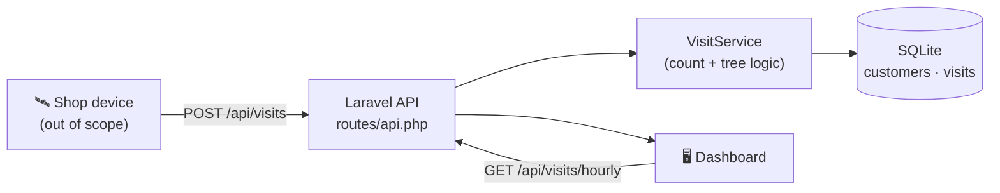

# TreeVisits 🌳

A small web service for the *"X visits = 1 tree"* idea: a shop device reports when
a customer walks in, the service counts visits per customer, remembers their last
visit, and plants one tree for every **X** visits (configurable). A simple
dashboard shows visits aggregated per hour.

Built with **PHP 8.3 + Laravel** and **SQLite**.

## Architecture



- **`customers`** — denormalized counters: `visits_count`, `trees_planted`, `last_visit_at`.
- **`visits`** — one row per event (`occurred_at`), used for the per-hour aggregation.

See [`docs/DECISIONS.md`](docs/DECISIONS.md) for the reasoning behind these choices.

## Running the project

### Option A — local PHP

Requires PHP 8.3+ (with `pdo_sqlite`) and [Composer](https://getcomposer.org/).

```bash
composer install
cp .env.example .env          # Windows: copy .env.example .env
php artisan key:generate
touch database/database.sqlite # Windows: New-Item database/database.sqlite
php artisan migrate
php artisan serve
```

Then open <http://localhost:8000>.

### Option B — Docker

```bash
docker compose up --build
```

Open <http://localhost:8000>. (The Docker setup is provided as a deliverable but
was not run in the environment it was authored in.)

### Configuration

| Variable          | Default | Meaning                              |
| ----------------- | ------- | ------------------------------------ |
| `VISITS_PER_TREE` | `5`     | Visits a customer needs per 1 tree.  |

### Tests

```bash
php artisan test
```

## Using the API

Base URL: `http://localhost:8000`. All endpoints return JSON.

A Postman collection is included at [`docs/TreeVisits.postman_collection.json`](docs/TreeVisits.postman_collection.json) —
import it and adjust the `baseUrl` collection variable if your server runs elsewhere.

### `POST /api/visits` — record a visit event

```bash
curl -X POST http://localhost:8000/api/visits \
  -H "Content-Type: application/json" \
  -d '{"customer_id": "customer-123"}'
```

`occurred_at` is optional (ISO‑8601); it defaults to the time the event is received.

```jsonc
// 201 Created
{
  "data": {
    "customer_id": "customer-123",
    "visits_count": 1,
    "trees_planted": 0,
    "last_visit_at": "2026-06-09T12:00:00+00:00"
  },
  "tree_planted": false   // true on the visit that crosses an X-visit boundary
}
```

Invalid bodies return `422` with validation errors.

### `GET /api/visits/hourly` — visits aggregated per hour

Optional `?customer_id=` filter. Powers the dashboard.

```bash
curl http://localhost:8000/api/visits/hourly
```

```json
{ "data": [ { "hour": "2026-06-09T12:00", "visits": 3 } ] }
```

### `GET /api/customers` — list customers

```bash
curl http://localhost:8000/api/customers
```

### `GET /api/customers/{customer_id}` — single customer state

```bash
curl http://localhost:8000/api/customers/customer-123
```

Returns `404` if the customer is unknown.

## Assumptions

- The **physical device is out of scope**; it sends a stable `customer_id` it
  already knows (card id, app id, …). The service creates the customer on first
  sight.
- **Trees are counted per customer** (`floor(visits / X)`), as stated in the brief.
- `X` (`VISITS_PER_TREE`) is configurable and applies globally to all customers.
- **No authentication / rate limiting** — out of scope for the exercise.
- The "per hour" buckets are computed in the database's stored time (UTC with the
  default config) using the visit's `occurred_at`.
